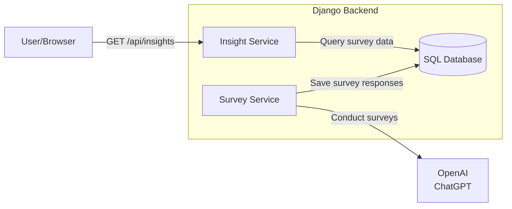

# survey-gorilla
Like SurveyMonkey, but with the muscle of LLMs and dynamic analysis.

## Project Intent
Automate survey analysis using AI to:
- Simulate human-like conversation surveys using ChatGPT.
- Extract insights via API endpoints.
- Demonstrate Django and OpenAI integration with deployable results.

**Example Implementation**:
- Survey topic: "Top 3 favorite foods"
- Key insight: Identify vegetarian/vegan preferences from responses.

## System Architecture
Here is a high level diagram illustrating what the system is composed of:

## Development Plan
1. Local Django setup with PostgreSQL
2. OpenAI integration for food preference chatbot
3. Simulation engine for 100 AI conversations
4. API endpoint for dietary analysis
5. Basic authentication layer
6. Azure deployment with Docker