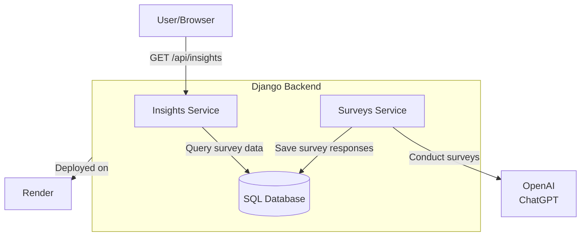

# survey-gorilla 🦍
Like SurveyMonkey, but with the muscle of LLMs and dynamic analysis.

AI-powered survey simulator with real-time dietary insight extraction via API.


## Contents
* [Project Intent](#project-intent)
* [System Architecture](#system-architecture)
* [Agile Workflow](#agile-workflow)
* [Sample API Usage](#sample-api-usage)
* [How to run](#how-to-run)
* [Future Development](#future-development)
---

## Project Intent
Automate survey analysis using AI to:
- Simulate human-like conversation surveys using ChatGPT.
- Extract insights via API endpoints.
- Demonstrate Django and OpenAI integration with deployable results.

**Example Implementation**:
- Survey topic: "Top 3 favorite foods"
- Key insight: Identify vegetarian/vegan preferences from responses.

## System Architecture
Here is a high level diagram illustrating what the system is composed of:


## Agile Workflow

All development was tracked using a Kanban board for clarity and progress.

👉 [View the SurveyGorilla Kanban board](https://github.com/users/sharbeldahlan/projects/4)

## Sample API Usage

Request
```
GET /api/insights/conversations?diet=vegan,vegetarian
```

Response
```json
[
  {
    "id": "df0195c7-45be-4ab3-9b7a-08d123abcxyz",
    "diet_type": "vegan",
    "favorite_foods": ["tofu", "kale", "lentils"],
    "created_at": "2025-05-26T12:34:56Z"
  },
  {
    "id": "a7b49a11-2f61-4933-82b0-fd1c009fdcde",
    "diet_type": "vegetarian",
    "favorite_foods": ["cheese", "avocado", "mushrooms"],
    "created_at": "2025-05-26T12:35:01Z"
  }
]
```
To fetch all conversations, simply omit the `diet` query parameter.

## How to run
This project runs fully containerized using Docker Compose.

1. Clone the repository and go to the project root:
   ```
   git clone git@github.com:<your_username>/survey-gorilla.git
   cd survey-gorilla
   ```

2. Create a `.env` file at the project root with the following:
   ```
   SECRET_KEY=your-django-secret-key
   OPENAI_API_KEY=your-openai-api-key
   POSTGRES_DB=surveydb
   POSTGRES_USER=surveyuser
   POSTGRES_PASSWORD=surveypass
   ```
   No need to install PostgreSQL locally. The database is containerized and configured via docker-compose.yml.


3. Start the app:
   ```
   docker-compose up --build -d
   ```
   Once ready, the app is available at `http://localhost:8000/api/insights/conversations`.


4. Optional: Run tests with coverage report, and other dev tools:

   Use `poetry run` here because these tools are listed in `pyproject.toml` as dev dependencies.
   ```
   poetry run docker-compose exec web pytest --cov
   poetry run ruff check
   poetry run pylint applications/
   poetry run flake8 applications/
   poetry run mypy applications/
   ```

## Future Development

1. Support for follow-up questions in simulated conversations.
2. Enhanced analysis: sentiment scoring for food preferences.
3. Extending the models to create many surveys.
4. An API for creating mutli-topic survey conversations.
5. Fine-tuning dietary classification logic for broader diet types.
