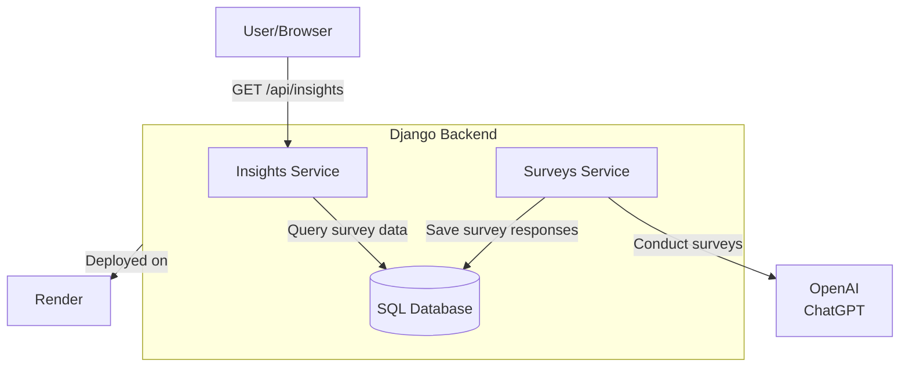

# SurveyGorilla 🦍  
*Like SurveyMonkey, but with the muscle of LLMs and dynamic analysis.*

SurveyGorilla is an AI assistant that automates survey analysis by simulating human-like conversations using ChatGPT, then delivering actionable insights via API.


## Contents
* [Project Intent](#project-intent) 🎯
* [System Architecture](#system-architecture) ⚙️
* [Live API Endpoint](#live-api-endpoint) 🚀
* ️[How to Run Locally](#how-to-run) 🛠
* [Agile Workflow](#agile-workflow) 🧮
* [Future Development](#future-development) 💡
---

## Project Intent 🎯 <a id="project-intent"></a>
Automate survey analysis using AI to:
- 🤖 Simulate human-like conversation surveys using ChatGPT.
- 📡 Extract insights via API endpoints.
- 🚀 Demonstrate Django and OpenAI integration with deployable results.

**Example Implementation**:
- Survey topic: "Top 3 favorite foods"
- Key insight: Identify vegetarian/vegan preferences from responses.

## System Architecture ⚙️️ <a id="system-architecture"></a>
Here is a high level diagram illustrating what the system is composed of:


## Live API Endpoint 🚀 <a id="live-api-endpoint"></a>

You can access this API endpoint through a browser:

🟢 https://survey-gorilla.onrender.com/api/insights/conversations?diet=vegetarian,vegan

🔐 Credentials:

```
Username: testuser
Password: testpass123
```
You will see the dietary insights that the SurveyGorilla AI assistant extracted from 100 simulated conversations it carried.

What happened in each simulated conversation:
1. 🗣️ SurveyGorilla assistant asked each survey respondent (which is another GhatGPT instance): "What are your top 3 favorite foods?"
2. 🏷 SurveyGorilla took the respondent's answer and classified the respondent's diet type ("vegan", "vegetarian", or "omnivore") based on the favorite foods.
3. 💾 SurveyGorilla stored the diet type, the parsed favorite foods, and the conversation's raw question and raw answer in the database.

See the next section for how to filter the simulated conversations by diet type using query parameters.

### Sample API Usage

The live endpoint above is a GET request with vegetarian,vegan query parameters to filter the conversations by those diet types.

Request
```
GET /api/insights/conversations?diet=vegetarian,vegan
```

Response
```json
[
  {
    "id": "df0195c7-45be-4ab3-9b7a-08d123abcxyz",
    "diet_type": "vegan",
    "favorite_foods": ["tofu", "kale", "lentils"],
    "created_at": "2025-05-30 03:21"
  },
  {
    "id": "a7b49a11-2f61-4933-82b0-fd1c009fdcde",
    "diet_type": "vegetarian",
    "favorite_foods": ["cheese", "avocado", "mushrooms"],
    "created_at": "2025-05-30 03:21"
  }
]
```

To filter by just one diet type (e.g. "omnivore"), change query parameter to that diet type (e.g. `?diet=omnivore`).

To fetch all conversations, simply omit the `diet` query parameter from your GET request.

## How to Run Locally 🛠 <a id="how-to-run"></a>

This project runs fully containerized using Docker Compose.

1. Clone the repository and go to the project root:
   ```
   git clone git@github.com:<your_username>/survey-gorilla.git
   cd survey-gorilla
   ```

2. Create a `.env` file at the project root with the following:
   ```
   SECRET_KEY=your-django-secret-key
   OPENAI_API_KEY=your-openai-api-key
   POSTGRES_DB=surveydb
   POSTGRES_USER=surveyuser
   POSTGRES_PASSWORD=surveypass
   ```
   No need to install PostgreSQL locally. The database is containerized and configured via docker-compose.yml.


3. Start the app:
   ```
   docker-compose up --build -d
   ```
   Once ready, the app is available at `http://localhost:8000/api/insights/conversations`.


4. Optional: Run tests with coverage report, and other dev tools:

   Use `poetry run` here because these tools are listed in `pyproject.toml` as dev dependencies.
   ```
   poetry run docker-compose exec web pytest --cov
   poetry run ruff check
   poetry run pylint applications/
   poetry run flake8 applications/
   poetry run mypy applications/
   ```

## Agile Workflow 🧮 <a id="agile-workflow"></a>

All development was tracked using a Kanban board for clarity and progress.

[View the SurveyGorilla Kanban board](https://github.com/users/sharbeldahlan/projects/4)

## Future Development 💡 <a id="future-development"></a>

1. Support for follow-up questions in simulated conversations.
2. Enhanced analysis: sentiment scoring for food preferences.
3. Extending the models to create many surveys.
4. An API for creating mutli-topic survey conversations.
5. Fine-tuning dietary classification logic for broader diet types.
